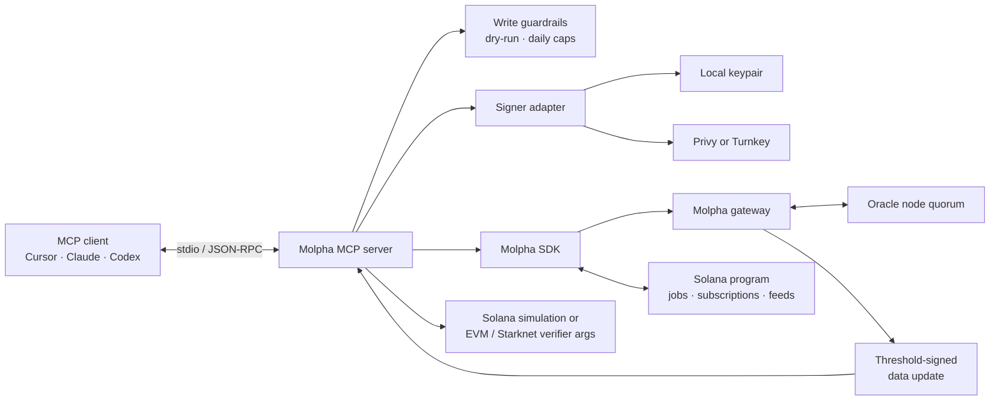

# Molpha MCP

[](https://github.com/Molpha/mcp/actions/workflows/ci.yml)
[](LICENSE)
[](package.json)

A [Model Context Protocol (MCP)](https://modelcontextprotocol.io/) server that lets AI agents create, fetch, verify, and publish [Molpha](https://docs.molpha.io/) oracle data.

Molpha turns HTTP API responses into threshold-signed payloads that can be verified on Solana, EVM, and Starknet. This server exposes that workflow as a small set of MCP tools and keeps signing behind a local, Privy, or Turnkey-backed wallet.

> [!WARNING]
> This release targets Solana Devnet and Sepolia verifier networks. Treat it as testnet software, not a production security boundary. Write tools spend SOL and may consume subscription quota unless dry-run mode is enabled.

## What you can do

- Discover the active registry, oracle nodes, gateways, and verifier deployments.
- Register a job that commits to an HTTP endpoint and response parser.
- Request a threshold-signed result and build verifier arguments for multiple chains.
- Simulate verification or submit a verified update to a Solana feed.
- Use a local keypair, Privy server wallet, or Turnkey wallet without changing the MCP tool surface.
- Put daily caps and a global dry-run default around agent-initiated writes.

## MCP tools

| Tool | Access | Description |
| --- | --- | --- |
| `molpha_get_capabilities` | Read | Return the registry version, node set, gateways, chains, and verifier metadata. |
| `molpha_describe_job` | Read | Read a job's on-chain state, gateway config, subscription status, and supported chains. |
| `molpha_create_job` | Write | Register a declarative API job. Requires an active subscription. |
| `molpha_fetch_verified` | Read/quota | Run or reuse a signing round and return the signed artifact plus verifier arguments. |
| `molpha_get_latest` | Read | Read the latest value stored in a Solana feed account. |
| `molpha_verify` | Read | Simulate verification on Solana or build EVM/Starknet verifier arguments. |
| `molpha_execute` | Write | Submit a signed data update to Solana. |

`molpha_verify` does not execute EVM or Starknet calls; it returns the verifier address and call arguments. `molpha_execute` currently submits only to Solana.

## Quick start

### Requirements

- Node.js 20 or later
- A Solana wallet funded with Devnet SOL
- Devnet USDC if you need to create jobs or request new signing rounds
- An MCP client such as Cursor, Claude Desktop, or Codex

### 1. Install and build

```bash
git clone https://github.com/Molpha/mcp.git
cd mcp
npm ci
cp .env.example .env
npm run build
```

### 2. Configure a signer

For local development, point `OWNER_KEYPAIR` at a Solana JSON keypair. Use an absolute path when an MCP client launches the server.

```dotenv
SIGNER_BACKEND=memory
OWNER_KEYPAIR=/absolute/path/to/owner-keypair.json
SOLANA_RPC=https://api.devnet.solana.com
GATEWAY_ENDPOINTS=https://gateway.molpha.io
```

The same wallet owns jobs, authenticates gateway requests, and signs Solana transactions. Do not commit `.env`, wallet files, or credentials.

Other supported signer configurations:

| Backend | Required configuration |
| --- | --- |
| Local keypair | `SIGNER_BACKEND=memory`, `OWNER_KEYPAIR` |
| Privy | `SIGNER_BACKEND=keychain`, `KEYCHAIN_BACKEND=privy`, `PRIVY_APP_ID`, `PRIVY_APP_SECRET`, `PRIVY_WALLET_ID`, `PRIVY_WALLET_ADDRESS` |
| Turnkey | `SIGNER_BACKEND=keychain`, `KEYCHAIN_BACKEND=turnkey`, `TURNKEY_API_PUBLIC_KEY`, `TURNKEY_API_PRIVATE_KEY`, `TURNKEY_ORGANIZATION_ID`, `TURNKEY_WALLET_ADDRESS` |

See [.env.example](.env.example) and the ready-to-edit files in [examples](examples) for every backend.

### 3. Check the setup

```bash
npm run doctor
```

The doctor checks the compiled entry point, signer configuration, wallet availability, and Solana RPC. It also prints configuration snippets with resolved absolute paths.

### 4. Bootstrap a subscription

Subscription operations debit USDC, so they are deliberately kept out of the MCP tool surface. Run the provisioning CLI once with the same signer configuration used by the server:

```bash
# Preview without sending a transaction
npm run provision -- subscribe --plan Basic --max-price-usdc 20000000 --dry-run

# Subscribe, with a maximum approved price of 20 USDC (6 decimals)
npm run provision -- subscribe --plan Basic --max-price-usdc 20000000
```

Extend an existing subscription with:

```bash
npm run provision -- extend --max-price-usdc 20000000
```

`--max-price-usdc` is a safety cap in raw USDC base units, not a quoted plan price. The transaction aborts if the live on-chain price exceeds the cap.

### 5. Connect an MCP client

Molpha MCP communicates over stdio. Point your client at the built server, not at `src/server.ts`:

```json
{
  "mcpServers": {
    "molpha": {
      "command": "node",
      "args": ["/absolute/path/to/mcp/dist/src/server.js"],
      "env": {
        "SIGNER_BACKEND": "memory",
        "OWNER_KEYPAIR": "/absolute/path/to/owner-keypair.json",
        "SOLANA_RPC": "https://api.devnet.solana.com",
        "GATEWAY_ENDPOINTS": "https://gateway.molpha.io"
      }
    }
  }
}
```

- Cursor: save the JSON under `mcpServers` in `.cursor/mcp.json` or `~/.cursor/mcp.json`.
- Claude Desktop: add it to `claude_desktop_config.json` and restart the app.
- Codex: use one of the [Codex TOML examples](examples/codex-memory.toml), or run `codex mcp add molpha -- node /absolute/path/to/mcp/dist/src/server.js` and then add the signer variables to `config.toml`.

Restart the client after changing configuration or rebuilding. A direct `node dist/src/server.js` invocation waits silently for JSON-RPC on stdin; that is expected for a stdio server.

## Example prompts

Once the server is connected, these prompts exercise the main workflows.

### Discover the network

> Use Molpha to inspect the current oracle capabilities. Summarize the registry version, node count, supported chains, gateway endpoints, and verifier addresses. Do not make any writes.

### Preview a job

> Dry-run a Molpha job for `https://api.example.com/v1/finalized/price` using the JSON path `$.price`, 8 decimals, and 3 required signatures. Show me the API config hash and any determinism warnings. Do not send a transaction.

Replace the example URL with a public endpoint that returns stable, independently reproducible data. Live ticker endpoints may produce different values across oracle nodes and fail to reach quorum.

### Fetch and verify a result

> For Molpha job `<JOB_ID>`, use its committed API config to fetch a signed result with a maximum age of 60 seconds for Solana and EVM. Verify it through the Solana simulation path, and summarize the signed value, timestamp, registry version, quorum, and EVM verifier call. Treat the signed artifact as the trust anchor; do not trust the value by itself.

### Publish with an approval checkpoint

> Read the latest value for Molpha job `<JOB_ID>`. If I provide a newer signed result, preview `molpha_execute` with `dryRun: true`, explain the fee-paying wallet and exact write, and wait for my confirmation before submitting it to Solana.

## Architecture



The server is an adapter and policy boundary, not a new source of truth:

1. The MCP client invokes a typed tool over stdio.
2. The signer authenticates gateway requests and owner transactions.
3. Oracle nodes independently fetch the committed API configuration and produce one aggregate signature after reaching quorum.
4. The server returns the self-contained signed artifact. Solana can verify or store it; EVM and Starknet consumers receive contract-ready verifier arguments.
5. Consumers trust a value only after verifying the signed payload against its registry version.

Provisioning is a separate CLI path because subscribing or extending debits USDC. It is never available to an autonomous MCP tool call.

## Configuration

| Variable | Default | Purpose |
| --- | --- | --- |
| `SIGNER_BACKEND` | `memory` | `memory` or `keychain` |
| `KEYCHAIN_BACKEND` | — | `privy` or `turnkey` for a keychain signer |
| `OWNER_KEYPAIR` | — | Local Solana JSON keypair path |
| `SOLANA_RPC` | `https://api.devnet.solana.com` | Solana RPC endpoint |
| `GATEWAY_ENDPOINTS` | SDK default | Comma-separated gateway URLs |
| `PROGRAM_ID` | SDK default | Optional Molpha program override |
| `MOLPHA_EVM_NETWORKS` | `evm-sepolia` | Comma-separated EVM verifier networks |
| `MOLPHA_STARKNET_NETWORKS` | `starknet-sepolia` | Comma-separated Starknet verifier networks |
| `MOLPHA_MAX_JOBS_PER_DAY` | `10` | Process-local daily job-creation cap |
| `MOLPHA_MAX_EXECUTES_PER_DAY` | `100` | Process-local daily Solana-submit cap |
| `MOLPHA_DRY_RUN` | `false` | Preview all writes when set to `true` |

The daily counters are process-local and reset when the server restarts. They are safety rails, not durable rate limits.

## Development

```bash
npm run dev        # start from TypeScript for local development
npm run typecheck  # validate types without emitting files
npm test           # run the Vitest suite
npm run build      # compile src/, cli/, and tests into dist/
```

Before opening a pull request, run:

```bash
npm run typecheck && npm test && npm run build
```

Bug reports and focused pull requests are welcome. For security issues, use [GitHub's private vulnerability reporting](https://github.com/Molpha/mcp/security/advisories/new) instead of a public issue.

## Documentation

- [Molpha protocol documentation](https://docs.molpha.io/)
- [Client configuration examples](examples)

## License

Released under the [MIT License](LICENSE).
