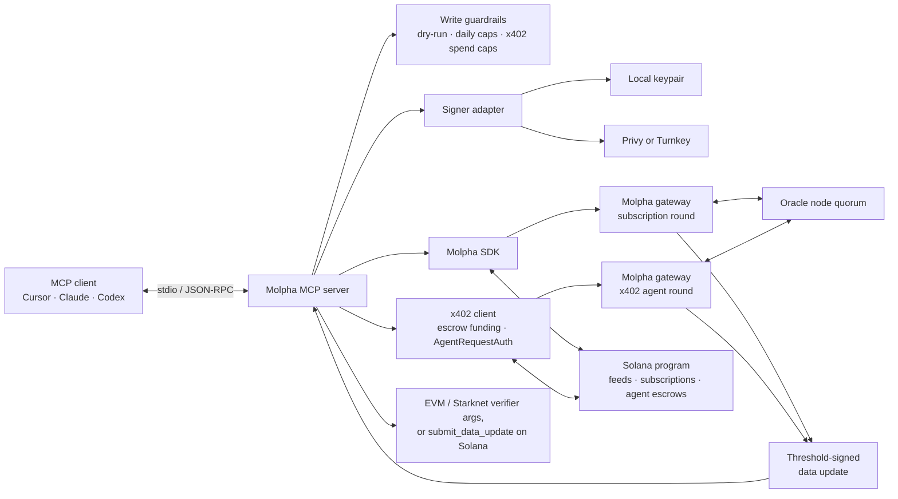

# Molpha MCP

[](https://github.com/Molpha/mcp/actions/workflows/ci.yml)
[](LICENSE)
[](package.json)

A [Model Context Protocol (MCP)](https://modelcontextprotocol.io/) server that lets AI agents create, fetch, verify, and publish [Molpha](https://docs.molpha.io/) oracle data.

Molpha turns HTTP API responses into threshold-signed payloads that can be verified on Solana, EVM, and Starknet. This server exposes that workflow as a small set of MCP tools and keeps signing behind a local, Privy, or Turnkey-backed wallet.

> [!WARNING]
> This release targets Solana Devnet and Sepolia verifier networks. Treat it as testnet software, not a production security boundary. Write tools spend SOL and may consume subscription quota unless dry-run mode is enabled.

## What you can do

- Discover the active registry, oracle nodes, gateways, and verifier deployments.
- Derive a feedId locally from a declarative API spec — no transaction, no subscription required. Feeds are created lazily on first settle.
- Request a threshold-signed result and build verifier arguments for multiple chains, paid for either by an active USDC subscription or a self-funded [x402](#x402-pay-per-request) round.
- Build EVM/Starknet verifier call args, or submit a verified update to a Solana feed.
- Use a local keypair, Privy server wallet, or Turnkey wallet without changing the MCP tool surface.
- Put daily caps and a global dry-run default around agent-initiated writes and x402 spend.

## MCP tools

| Tool | Access | Description |
| --- | --- | --- |
| `molpha_get_capabilities` | Read | Return the registry version, node set, gateways, chains, verifier metadata, and x402 caps. |
| `molpha_describe_feed` | Read | Read a feed's on-chain state and subscription status. Pass `feedId`, or `apiConfig` + `signaturesRequired` to derive it. |
| `molpha_derive_feed` | Read | Locally derive a feedId from `apiConfig` + `signaturesRequired`. No transaction. |
| `molpha_agent_status` | Read | Read the x402 agent escrow (USDC balance, committed amount, quoted next price) for the current signer. |
| `molpha_fetch_verified` | Read/quota/spend | Run a signing round and return the signed artifact plus verifier arguments. `payment: "subscription" \| "x402" \| "auto"` selects how the round is paid for; `autoSubmit: true` settles the Solana leg in the same call. |
| `molpha_get_latest` | Read | Read the latest value stored in a Solana feed account. |
| `molpha_verify` | Read | Build EVM/Starknet verifier address and call arguments (calldata only, by design). |
| `molpha_execute` | Write | Submit a signed data update to Solana. Accepts the `molpha_fetch_verified` output unmodified. |

`molpha_verify` stops at calldata **by design**: the Molpha verifier is stateless, so the agent executes `verify()` itself and the server never submits an EVM/Starknet transaction or vouches for a result it did not verify on-chain. Solana is the one leg this server settles — via `molpha_execute` or `molpha_fetch_verified`'s `autoSubmit` — and there is no standalone Solana verify-simulation path; submit, then read the result back with `molpha_get_latest`.

`molpha_execute` and `molpha_verify` take the `molpha_fetch_verified` response as-is: no field remapping between calls, and short hex fields (the gateway emits a one-signer `signersBitmap` as `"4"`) are zero-padded to their canonical widths server-side.

## Quick start

### Requirements

- Node.js 20 or later
- A Solana wallet funded with Devnet SOL
- Devnet USDC if you plan to use an active subscription or the x402 pay-per-request path
- An MCP client such as Cursor, Claude Desktop, or Codex

### 1. Install and build

```bash
git clone https://github.com/Molpha/mcp.git
cd mcp
npm ci
cp .env.example .env
npm run build
```

### 2. Configure a signer

For local development, point `OWNER_KEYPAIR` at a Solana JSON keypair. Use an absolute path when an MCP client launches the server.

```dotenv
SIGNER_BACKEND=memory
OWNER_KEYPAIR=/absolute/path/to/owner-keypair.json
SOLANA_RPC=https://api.devnet.solana.com
GATEWAY_ENDPOINTS=
```

The same wallet owns feeds and any x402 escrow, authenticates gateway requests, and signs Solana transactions. Do not commit `.env`, wallet files, or credentials.

Other supported signer configurations:

| Backend | Required configuration |
| --- | --- |
| Local keypair | `SIGNER_BACKEND=memory`, `OWNER_KEYPAIR` |
| Privy | `SIGNER_BACKEND=keychain`, `KEYCHAIN_BACKEND=privy`, `PRIVY_APP_ID`, `PRIVY_APP_SECRET`, `PRIVY_WALLET_ID`, `PRIVY_WALLET_ADDRESS` |
| Turnkey | `SIGNER_BACKEND=keychain`, `KEYCHAIN_BACKEND=turnkey`, `TURNKEY_API_PUBLIC_KEY`, `TURNKEY_API_PRIVATE_KEY`, `TURNKEY_ORGANIZATION_ID`, `TURNKEY_WALLET_ADDRESS` |

See [.env.example](.env.example) and the ready-to-edit files in [examples](examples) for every backend.

### 3. Check the setup

```bash
npm run doctor
```

The doctor checks the compiled entry point, signer configuration, wallet availability, and Solana RPC. It also prints configuration snippets with resolved absolute paths.

### 4. Bootstrap a subscription

Subscription operations debit USDC, so they are deliberately kept out of the MCP tool surface. Run the provisioning CLI once with the same signer configuration used by the server:

```bash
# Preview without sending a transaction
npm run provision -- subscribe --plan Basic --max-price-usdc 20000000 --dry-run

# Subscribe, with a maximum approved price of 20 USDC (6 decimals)
npm run provision -- subscribe --plan Basic --max-price-usdc 20000000
```

Extend an existing subscription with:

```bash
npm run provision -- extend --max-price-usdc 20000000
```

`--max-price-usdc` is a safety cap in raw USDC base units, not a quoted plan price. The transaction aborts if the live on-chain price exceeds the cap.

### 5. Connect an MCP client

Pick one of the install paths below. In both cases the server speaks stdio JSON-RPC and needs the same signer settings from step 2.

#### Claude Desktop (MCPB)

Package the built tree into an [MCP Bundle](https://github.com/modelcontextprotocol/mcpb) and install it as a desktop extension. The repo already includes a [`manifest.json`](manifest.json) that declares the Node entry point, tools, and user-config fields.

```bash
npm run build
npx @anthropic-ai/mcpb pack . molpha-mcp.mcpb
```

That writes `molpha-mcp.mcpb` in the repo root. Install it in Claude Desktop by any of:

- Double-click the `.mcpb` file
- Drag it into the Claude Desktop window
- Settings → Extensions → Advanced settings → Install Extension… → select the `.mcpb` file

During install, set the signer backend and related fields (local keypair path, Privy, or Turnkey). Those map to the same env vars as `.env.example`.

#### Cursor, Codex, or manual Claude Desktop config

Point the client at the built server (`dist/src/server.js`), not at `src/server.ts`:

```json
{
  "mcpServers": {
    "molpha": {
      "command": "node",
      "args": ["/absolute/path/to/mcp/dist/src/server.js"],
      "env": {
        "SIGNER_BACKEND": "memory",
        "OWNER_KEYPAIR": "/absolute/path/to/owner-keypair.json",
        "SOLANA_RPC": "https://api.devnet.solana.com"
      }
    }
  }
}
```

- Cursor: save the JSON under `mcpServers` in `.cursor/mcp.json` or `~/.cursor/mcp.json`. Ready-to-edit copies live in [examples](examples) (`cursor-memory.mcp.json`, `cursor-privy.mcp.json`, `cursor-turnkey.mcp.json`).
- Claude Desktop: add the same block to `claude_desktop_config.json` and restart, or prefer the MCPB path above.
- Codex: use one of the [Codex TOML examples](examples/codex-memory.toml), or run `codex mcp add molpha -- node /absolute/path/to/mcp/dist/src/server.js` and then add the signer variables to `config.toml`.

Restart the client after changing configuration or rebuilding. A direct `node dist/src/server.js` invocation waits silently for JSON-RPC on stdin; that is expected for a stdio server.

## Example prompts

Once the server is connected, these prompts exercise the main workflows.

### Discover the network

> Use Molpha to inspect the current oracle capabilities. Summarize the registry version, node count, supported chains, gateway endpoints, and verifier addresses. Do not make any writes.

### Preview a feed

> Derive a Molpha feedId for `https://api.example.com/v1/finalized/price` using the JSON path `$.price` and 3 required signatures. Show me the API config hash, the derived feedId, and any determinism warnings. Do not send a transaction.

Replace the example URL with a public endpoint that returns stable, independently reproducible data. Live ticker endpoints may produce different values across oracle nodes and fail to reach quorum.

### Fetch and verify a result

> For that same feed, fetch a signed result with `payment: "auto"` and a maximum age of 60 seconds, for the EVM chain. Summarize the signed value, timestamp, registry version, quorum, and EVM verifier call, and tell me whether it was paid for via subscription or x402. Treat the signed artifact as the trust anchor; do not trust the value by itself.

### Check x402 spend before paying

> Call `molpha_agent_status` for 3 required signatures. Tell me the escrow's USDC balance, committed amount, and quoted next price before I authorize any x402 spend.

### Publish with an approval checkpoint

> Read the latest value for Molpha feed `<FEED_ID>`. If I provide a newer signed result, preview `molpha_execute` with `dryRun: true`, explain the fee-paying wallet and exact write, and wait for my confirmation before submitting it to Solana.

## Architecture



The server is an adapter and policy boundary, not a new source of truth:

1. The MCP client invokes a typed tool over stdio.
2. The signer authenticates gateway requests and owner transactions.
3. Oracle nodes independently fetch the committed API configuration and produce one aggregate signature after reaching quorum.
4. The server returns the self-contained signed artifact. Solana can verify or store it; EVM and Starknet consumers receive contract-ready verifier arguments.
5. Consumers trust a value only after verifying the signed payload against its registry version.

Provisioning is a separate CLI path because subscribing or extending debits USDC. It is never available to an autonomous MCP tool call.

## Configuration

| Variable | Default | Purpose |
| --- | --- | --- |
| `SIGNER_BACKEND` | `memory` | `memory` or `keychain` |
| `KEYCHAIN_BACKEND` | — | `privy` or `turnkey` for a keychain signer |
| `OWNER_KEYPAIR` | — | Local Solana JSON keypair path |
| `SOLANA_RPC` | `https://api.devnet.solana.com` | Solana RPC endpoint |
| `GATEWAY_ENDPOINTS` | `https://dev-gateway.molpha.io` | Comma-separated **Molpha gateway** base URLs (not your Solana RPC). Must expose `/v1/nodes` and signing routes (`/v1/agent/execute` for x402, `/v1/round/execute` for subscription). Run `npm run doctor` to verify. |
| `MOLPHA_EVM_NETWORKS` | `evm-sepolia` | Comma-separated EVM verifier networks |
| `MOLPHA_STARKNET_NETWORKS` | `starknet-sepolia` | Comma-separated Starknet verifier networks |
| `MOLPHA_MAX_EXECUTES_PER_DAY` | `100` | Process-local daily Solana-submit cap |
| `MOLPHA_DRY_RUN` | `false` | Preview all writes when set to `true` |
| `MOLPHA_X402_MAX_PRICE_USDC` | `1` | Refuse to fund an x402 round priced above this (decimal USDC) |
| `MOLPHA_X402_MAX_SPEND_PER_DAY_USDC` | `10` | Process-local daily x402 spend cap (decimal USDC) |
| `MOLPHA_X402_GATEWAY_PDA` | — | Optional: skip the x402 discovery round-trip when the gateway's PDA is known out of band |

The daily counters are process-local and reset when the server restarts. They are safety rails, not durable rate limits.

## x402 pay-per-request

`molpha_fetch_verified` accepts a `payment` argument:

- `"subscription"` — use the caller's active USDC subscription (see [Bootstrap a subscription](#4-bootstrap-a-subscription)). Fails if the subscription is inactive or out of quota.
- `"x402"` — self-fund the round from a per-signer escrow account, with no subscription required. If the escrow is underfunded, the MCP server funds it from the signer's own USDC balance (creating the escrow's associated token account if needed) up to `MOLPHA_X402_MAX_PRICE_USDC` per round and `MOLPHA_X402_MAX_SPEND_PER_DAY_USDC` per day, then refuses with a clear error above those caps.
- `"auto"` (default) — use the subscription when active, otherwise fall back to `"x402"`.

Call `molpha_agent_status` to inspect the escrow (USDC balance, amount already committed to unsettled rounds, and the quoted price for a given quorum) before spending, or to confirm a round settled. `encryptSecrets` (private API secrets) is not yet supported on the x402 path — use `payment: "subscription"` for feeds with encrypted secrets.

## Development

```bash
npm run dev        # start from TypeScript for local development
npm run typecheck  # validate types without emitting files
npm test           # run the Vitest suite
npm run build      # compile src/, cli/, and tests into dist/
```

Before opening a pull request, run:

```bash
npm run typecheck && npm test && npm run build
```

Bug reports and focused pull requests are welcome. For security issues, use [GitHub's private vulnerability reporting](https://github.com/Molpha/mcp/security/advisories/new) instead of a public issue.

## Releasing

Versioning and publishing are automated with [Changesets](https://github.com/changesets/changesets). If your pull request changes published behavior, add a changeset:

```bash
npx changeset
```

This records the bump type (patch/minor/major) and a changelog entry. On merge to `main`, [.github/workflows/release.yml](.github/workflows/release.yml):

1. Opens or updates a "Version Packages" pull request that bumps `package.json`, `manifest.json`, and `server.json` in lockstep and updates `CHANGELOG.md`.
2. When that PR is merged, publishes `@molpha/mcp` to npm using [trusted publishing](https://docs.npmjs.com/trusted-publishers) (GitHub Actions OIDC — no npm token in CI), then publishes `server.json` to the [MCP registry](https://registry.modelcontextprotocol.io/) using `mcp-publisher` with GitHub OIDC login.

No secrets are needed for either publish step; both rely on the workflow's `id-token: write` permission and are authorized via each registry's trust relationship with this repository.

## Documentation

- [Molpha protocol documentation](https://docs.molpha.io/)
- [Client configuration examples](examples)
- [MCPB manifest](manifest.json) for Claude Desktop / `.mcpb` packaging

## License

Released under the [MIT License](LICENSE).
