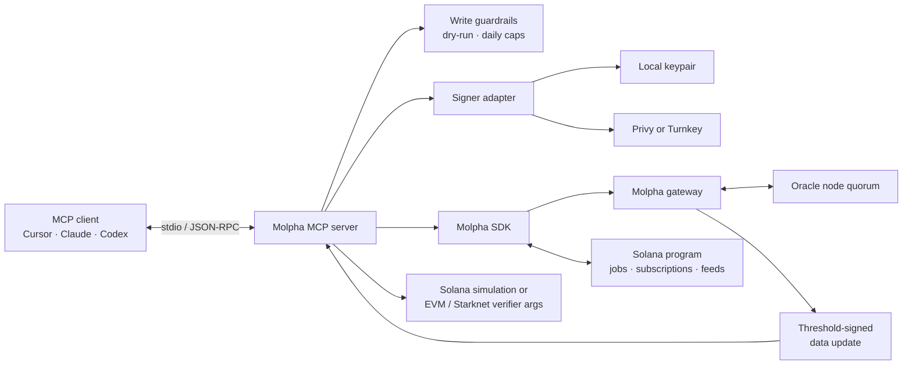

The Molpha MCP server gives AI agents a typed interface for discovering the oracle network, creating data jobs, requesting threshold-signed results, verifying them, and publishing updates to Solana.

The server runs locally over [Model Context Protocol](https://modelcontextprotocol.io/) stdio and uses [`@molpha-oracle/sdk`](https://www.npmjs.com/package/@molpha-oracle/sdk) for gateway and on-chain operations. Source code is available in the [`Molpha/mcp`](https://github.com/Molpha/mcp) repository.

<Warning>
  The current release targets Solana Devnet and Sepolia verifier networks. Write tools spend Devnet SOL and may consume subscription quota unless dry-run mode is enabled.
</Warning>

## What the server exposes

| Tool | Access | Purpose |
| --- | --- | --- |
| `molpha_get_capabilities` | Read | Discover the registry version, nodes, gateways, supported chains, and verifier metadata. |
| `molpha_describe_job` | Read | Inspect a job, its gateway config, subscription status, and supported chains. |
| `molpha_create_job` | Write | Register a declarative HTTP API job. |
| `molpha_fetch_verified` | Read/quota | Request or reuse a signing round and return the signed artifact plus verifier arguments. |
| `molpha_get_latest` | Read | Read the latest on-chain Solana feed. |
| `molpha_verify` | Read | Simulate verification on Solana or build an EVM/Starknet verifier call. |
| `molpha_execute` | Write | Submit a signed data update to Solana. |

<Note>
  EVM and Starknet execution is not performed by the MCP server. It returns verifier addresses and contract-ready arguments for those chains. `molpha_execute` currently submits only to Solana.
</Note>

## Architecture



The MCP server is an adapter and policy boundary. The signed `DataUpdate` remains the trust anchor:

1. An MCP client invokes a typed tool over stdio.
2. The selected wallet signs gateway authentication messages and owner transactions.
3. Oracle nodes independently fetch the job's committed API configuration and aggregate a signature after reaching quorum.
4. The server returns the signed artifact and chain-specific verifier arguments.
5. A consumer verifies the payload against its registry version before using the value.

Subscription and extension operations are kept in a separate CLI because they debit USDC. They are not available as MCP tools.

## Install

### Prerequisites

- Node.js 20 or later
- An MCP client such as Cursor, Claude Desktop, or Codex
- A Solana wallet funded with Devnet SOL
- Devnet USDC for subscription operations

<Steps>
  <Step title="Clone and build">
    ```bash theme={null}
    git clone https://github.com/Molpha/mcp.git
    cd mcp
    npm ci
    cp .env.example .env
    npm run build
    ```
  </Step>

  <Step title="Choose a signer">
    The local signer is the simplest option for development:

    ```dotenv theme={null}
    SIGNER_BACKEND=memory
    OWNER_KEYPAIR=/absolute/path/to/owner-keypair.json
    SOLANA_RPC=https://api.devnet.solana.com
    GATEWAY_ENDPOINTS=https://brebeneskul.gateway.molpha.io
    ```

    For hosted signing, use one of these variable sets:

    <Tabs>
      <Tab title="Privy">
        ```dotenv theme={null}
        SIGNER_BACKEND=keychain
        KEYCHAIN_BACKEND=privy
        PRIVY_APP_ID=<your-app-id>
        PRIVY_APP_SECRET=<your-app-secret>
        PRIVY_WALLET_ID=<your-wallet-id>
        PRIVY_WALLET_ADDRESS=<base58-solana-address>
        ```
      </Tab>

      <Tab title="Turnkey">
        ```dotenv theme={null}
        SIGNER_BACKEND=keychain
        KEYCHAIN_BACKEND=turnkey
        TURNKEY_API_PUBLIC_KEY=<your-api-public-key>
        TURNKEY_API_PRIVATE_KEY=<your-api-private-key>
        TURNKEY_ORGANIZATION_ID=<your-organization-id>
        TURNKEY_WALLET_ADDRESS=<base58-solana-address>
        ```
      </Tab>
    </Tabs>

    The same wallet must be used for provisioning and MCP runtime operations. Jobs are wallet-owned.
  </Step>

  <Step title="Validate the setup">
    ```bash theme={null}
    npm run doctor
    ```

    The doctor validates the compiled server, signer, wallet, and Solana RPC, then prints client configuration snippets with absolute paths.
  </Step>

  <Step title="Bootstrap a subscription">
    Preview the transaction first, then subscribe with an explicit maximum USDC price:

    ```bash theme={null}
    npm run provision -- subscribe --plan Basic --max-price-usdc 20000000 --dry-run
    npm run provision -- subscribe --plan Basic --max-price-usdc 20000000
    ```

    `20000000` is 20 USDC at 6 decimals. This is a safety cap; the transaction aborts if the on-chain price is higher.
  </Step>

  <Step title="Connect your MCP client">
    Point the client to the compiled stdio entry point:

    <Tabs>
      <Tab title="Cursor / Claude Desktop">
        ```json theme={null}
        {
          "mcpServers": {
            "molpha": {
              "command": "node",
              "args": ["/absolute/path/to/mcp/dist/src/server.js"],
              "env": {
                "SIGNER_BACKEND": "memory",
                "OWNER_KEYPAIR": "/absolute/path/to/owner-keypair.json",
                "SOLANA_RPC": "https://api.devnet.solana.com",
                "GATEWAY_ENDPOINTS": "https://brebeneskul.gateway.molpha.io"
              }
            }
          }
        }
        ```
      </Tab>

      <Tab title="Codex">
        ```toml theme={null}
        [mcp_servers.molpha]
        command = "node"
        args = ["/absolute/path/to/mcp/dist/src/server.js"]

        [mcp_servers.molpha.env]
        SIGNER_BACKEND = "memory"
        OWNER_KEYPAIR = "/absolute/path/to/owner-keypair.json"
        SOLANA_RPC = "https://api.devnet.solana.com"
        GATEWAY_ENDPOINTS = "https://brebeneskul.gateway.molpha.io"
        ```
      </Tab>
    </Tabs>

    Restart the client after saving the configuration. Then ask it to call `molpha_get_capabilities`.
  </Step>
</Steps>

<Warning>
  Never commit `.env`, wallet keypairs, Privy secrets, or Turnkey credentials. Prefer absolute paths in MCP configuration because clients may start the server from a different working directory.
</Warning>

## Example prompts

### Inspect the network

> Use Molpha to inspect the current oracle capabilities. Summarize the registry version, node count, supported chains, gateway endpoints, and verifier addresses. Do not make any writes.

### Preview a job

> Dry-run a Molpha job for `https://api.example.com/v1/finalized/price` using the JSON path `$.price`, 8 decimals, and 3 required signatures. Show me the API config hash and any determinism warnings. Do not send a transaction.

Use an endpoint whose response is stable enough for independent nodes to reproduce. Fast-moving ticker APIs can return different values to different nodes and fail to reach quorum.

### Fetch and verify

> For Molpha job `<JOB_ID>`, use its committed API config to fetch a signed result with a maximum age of 60 seconds for Solana and EVM. Verify it through the Solana simulation path, and summarize the signed value, timestamp, registry version, quorum, and EVM verifier call. Treat the signed artifact as the trust anchor; do not trust the value by itself.

### Preview a Solana update

> Read the latest value for Molpha job `<JOB_ID>`. If I provide a newer signed result, preview `molpha_execute` with `dryRun: true`, explain the fee-paying wallet and exact write, and wait for my confirmation before submitting it to Solana.

## Guardrails

The server provides process-local safety rails around write tools:

| Variable | Default | Effect |
| --- | --- | --- |
| `MOLPHA_DRY_RUN` | `false` | Preview every write when set to `true`. |
| `MOLPHA_MAX_JOBS_PER_DAY` | `10` | Limit job registrations per process and UTC day. |
| `MOLPHA_MAX_EXECUTES_PER_DAY` | `100` | Limit Solana submissions per process and UTC day. |

The counters reset when the MCP server restarts. Use durable policy and wallet controls in addition to these guardrails for higher-risk environments.

## Troubleshooting

<AccordionGroup>
  <Accordion title="The server appears to hang">
    `node dist/src/server.js` waits for JSON-RPC on stdin and normally prints nothing. Launch it through an MCP client, then call `molpha_get_capabilities`.
  </Accordion>

  <Accordion title="The MCP client cannot find the server">
    Run `npm run build`, use an absolute path to `dist/src/server.js`, and restart the client. `npm run doctor` prints a resolved configuration snippet.
  </Accordion>

  <Accordion title="Job creation reports an inactive subscription">
    Run the provisioning CLI with the same signer used by the MCP server. The wallet that subscribes must also own the job.
  </Accordion>

  <Accordion title="Oracle nodes do not reach quorum">
    Check that the endpoint returns deterministic, settled data. Every selected node must derive a byte-identical normalized value for the round to aggregate successfully.
  </Accordion>
</AccordionGroup>

## Next steps

<CardGroup cols={2}>
  <Card title="How Molpha works" icon="diagram-project" href="/getting-started/how-it-works">
    Follow a value from an HTTP response to a cross-chain aggregate signature.
  </Card>

  <Card title="Jobs" icon="list-check" href="/concepts/jobs">
    Learn how API configurations are committed and jobs are identified.
  </Card>

  <Card title="Verifier overview" icon="shield-check" href="/verifiers/overview">
    Understand verification across Solana, EVM, and Starknet.
  </Card>

  <Card title="GitHub repository" icon="github" href="https://github.com/Molpha/mcp">
    Review the source, configuration examples, and issue tracker.
  </Card>
</CardGroup>
